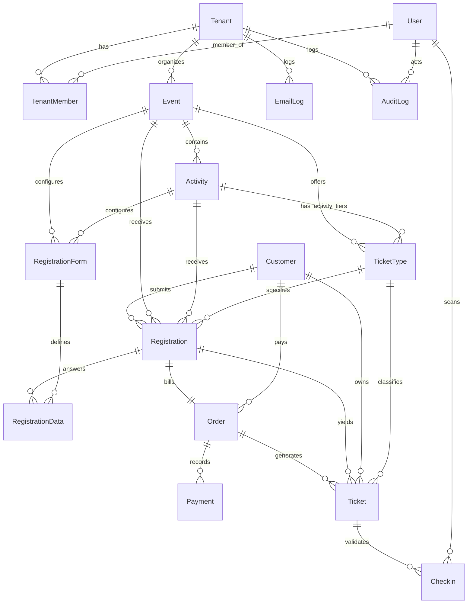

# Ticket Panda — Sequelize to Prisma ORM Migration Audit
**Audit Date:** 2026-09-20  
**Target Environment:** Node.js v24.x LTS (ES Modules) | Prisma ORM 5.x / 6.x | MySQL 8.4 LTS  
**Target Database:** `ticket_panda_dev` on `localhost:3306`

---

## 1. Executive Summary
This document provides a comprehensive audit of the Ticket Panda backend persistence layer currently implemented with Sequelize ORM (`sequelize ^6.37.3`, `mysql2 ^3.11.0`). Ticket Panda is a production multi-tenant event ticketing and entry-verification platform. 

The purpose of this audit is to catalog all models, data types, field constraints, relationships, indexes, transactions, row-locking patterns, and raw queries to ensure a 1:1, zero-regression migration to Prisma ORM without altering any business logic, API contracts, or security guarantees.

---

## 2. Models Inventory & Field Specifications

### 2.1 `User` (`users`)
- **Purpose**: Platform administrators and tenant staff members.
- **Fields**:
  - `id`: `INTEGER`, Primary Key, Auto Increment (`id`)
  - `name`: `VARCHAR(150)`, NOT NULL (`name`)
  - `email`: `VARCHAR(150)`, NOT NULL, UNIQUE (`email`)
  - `passwordHash`: `VARCHAR(255)`, NOT NULL (`password_hash`)
  - `phone`: `VARCHAR(20)`, NULL (`phone`)
  - `avatarUrl`: `VARCHAR(500)`, NULL (`avatar_url`)
  - `role`: `ENUM('SUPER_ADMIN', 'SUPPORT')`, NULL (`role`)
  - `isActive`: `BOOLEAN`, NOT NULL, DEFAULT `true` (`is_active`)
  - `lastLoginAt`: `DATETIME`, NULL (`last_login_at`)
  - `createdAt`: `DATETIME`, NOT NULL (`created_at`)
  - `updatedAt`: `DATETIME`, NOT NULL (`updated_at`)
- **Indexes**:
  - `UNIQUE(email)`
  - `INDEX(role)`
  - `INDEX(is_active)`

### 2.2 `Tenant` (`tenants`)
- **Purpose**: Organizers / colleges / event entities hosting events.
- **Fields**:
  - `id`: `INTEGER`, Primary Key, Auto Increment (`id`)
  - `name`: `VARCHAR(150)`, NOT NULL (`name`)
  - `slug`: `VARCHAR(100)`, NOT NULL, UNIQUE (`slug`)
  - `email`: `VARCHAR(150)`, NOT NULL, UNIQUE (`email`)
  - `phone`: `VARCHAR(20)`, NULL (`phone`)
  - `logoUrl`: `VARCHAR(500)`, NULL (`logo_url`)
  - `websiteUrl`: `VARCHAR(255)`, NULL (`website_url`)
  - `address`: `TEXT`, NULL (`address`)
  - `description`: `TEXT`, NULL (`description`)
  - `category`: `VARCHAR(100)`, NULL (`category`)
  - `coverImageUrl`: `VARCHAR(500)`, NULL (`cover_image_url`)
  - `socialLinks`: `JSON`, NULL (`social_links`)
  - `supportEmail`: `VARCHAR(150)`, NULL (`support_email`)
  - `supportPhone`: `VARCHAR(20)`, NULL (`support_phone`)
  - `brandingJson`: `JSON`, NULL (`branding_json`)
  - `status`: `ENUM('ACTIVE', 'SUSPENDED', 'PENDING_VERIFICATION')`, NOT NULL, DEFAULT `'PENDING_VERIFICATION'` (`status`)
  - `subscriptionPlan`: `ENUM('FREE', 'STARTER', 'GROWTH', 'ENTERPRISE')`, NOT NULL, DEFAULT `'FREE'` (`subscription_plan`)
  - `settings`: `JSON`, NULL (`settings`)
  - `createdAt`: `DATETIME`, NOT NULL (`created_at`)
  - `updatedAt`: `DATETIME`, NOT NULL (`updated_at`)
- **Indexes**:
  - `UNIQUE(slug)`
  - `UNIQUE(email)`
  - `INDEX(status)`

### 2.3 `TenantMember` (`tenant_members`)
- **Purpose**: Junction associating users with tenants with role-based permissions.
- **Fields**:
  - `id`: `INTEGER`, Primary Key, Auto Increment (`id`)
  - `userId`: `INTEGER`, NOT NULL (`user_id`), FK -> `users.id` (CASCADE)
  - `tenantId`: `INTEGER`, NOT NULL (`tenant_id`), FK -> `tenants.id` (CASCADE)
  - `role`: `ENUM('TENANT_ADMIN', 'EVENT_MANAGER', 'GATE_STAFF')`, NOT NULL (`role`)
  - `assignedEvents`: `JSON`, NULL (`assigned_events`)
  - `isActive`: `BOOLEAN`, NOT NULL, DEFAULT `true` (`is_active`)
  - `invitedBy`: `INTEGER`, NULL (`invited_by`), FK -> `users.id` (SET NULL)
  - `createdAt`: `DATETIME`, NOT NULL (`created_at`)
  - `updatedAt`: `DATETIME`, NOT NULL (`updated_at`)
- **Indexes**:
  - `UNIQUE(user_id, tenant_id)`
  - `INDEX(tenant_id, role)`
  - `INDEX(user_id)`

### 2.4 `Customer` (`customers`)
- **Purpose**: End-users registering for events and buying tickets across tenants.
- **Fields**:
  - `id`: `INTEGER`, Primary Key, Auto Increment (`id`)
  - `name`: `VARCHAR(150)`, NOT NULL (`name`)
  - `email`: `VARCHAR(150)`, NOT NULL (`email`)
  - `phone`: `VARCHAR(20)`, NULL (`phone`)
  - `isVerified`: `BOOLEAN`, NOT NULL, DEFAULT `false` (`is_verified`)
  - `createdAt`: `DATETIME`, NOT NULL (`created_at`)
  - `updatedAt`: `DATETIME`, NOT NULL (`updated_at`)
- **Indexes**:
  - `INDEX(email)`
  - `INDEX(phone)`

### 2.5 `Event` (`events`)
- **Purpose**: Events and festivals hosted by tenants.
- **Fields**:
  - `id`: `INTEGER`, Primary Key, Auto Increment (`id`)
  - `tenantId`: `INTEGER`, NOT NULL (`tenant_id`), FK -> `tenants.id` (CASCADE)
  - `title`: `VARCHAR(200)`, NOT NULL (`title`)
  - `slug`: `VARCHAR(200)`, NOT NULL (`slug`)
  - `shortDescription`: `VARCHAR(500)`, NULL (`short_description`)
  - `description`: `TEXT`, NULL (`description`)
  - `bannerUrl`: `VARCHAR(500)`, NULL (`banner_url`)
  - `venueName`: `VARCHAR(200)`, NULL (`venue_name`)
  - `venueAddress`: `TEXT`, NULL (`venue_address`)
  - `venueMapUrl`: `VARCHAR(500)`, NULL (`venue_map_url`)
  - `startAt`: `DATETIME`, NULL (`start_at`)
  - `endAt`: `DATETIME`, NULL (`end_at`)
  - `eventDate`: `DATE`, NULL (`event_date`)
  - `eventTimeStart`: `TIME`, NULL (`event_time_start`)
  - `eventTimeEnd`: `TIME`, NULL (`event_time_end`)
  - `maxCapacity`: `INTEGER`, NULL (`max_capacity`)
  - `registrationOpenAt`: `DATETIME`, NULL (`registration_open_at`)
  - `registrationCloseAt`: `DATETIME`, NULL (`registration_close_at`)
  - `registrationDeadline`: `DATETIME`, NULL (`registration_deadline`)
  - `rules`: `TEXT`, NULL (`rules`)
  - `faqJson`: `JSON`, NULL (`faq_json`)
  - `contactJson`: `JSON`, NULL (`contact_json`)
  - `galleryUrls`: `JSON`, NULL (`gallery_urls`)
  - `status`: `ENUM('DRAFT', 'PUBLISHED', 'CLOSED', 'CANCELLED')`, NOT NULL, DEFAULT `'DRAFT'` (`status`)
  - `settings`: `JSON`, NULL (`settings`)
  - `createdBy`: `INTEGER`, NULL (`created_by`), FK -> `users.id` (SET NULL)
  - `createdAt`: `DATETIME`, NOT NULL (`created_at`)
  - `updatedAt`: `DATETIME`, NOT NULL (`updated_at`)
- **Indexes**:
  - `UNIQUE(tenant_id, slug)`
  - `INDEX(tenant_id, status)`
  - `INDEX(slug)`
  - `INDEX(event_date)`

### 2.6 `Activity` (`activities`)
- **Purpose**: Sub-events, competitions, workshops, or stages within an Event/Festival.
- **Fields**:
  - `id`: `INTEGER`, Primary Key, Auto Increment (`id`)
  - `tenantId`: `INTEGER`, NOT NULL (`tenant_id`), FK -> `tenants.id` (CASCADE)
  - `eventId`: `INTEGER`, NOT NULL (`event_id`), FK -> `events.id` (CASCADE)
  - `slug`: `VARCHAR(200)`, NOT NULL (`slug`)
  - `title`: `VARCHAR(200)`, NOT NULL (`title`)
  - `shortDescription`: `VARCHAR(500)`, NULL (`short_description`)
  - `description`: `TEXT`, NULL (`description`)
  - `posterUrl`: `VARCHAR(500)`, NULL (`poster_url`)
  - `rules`: `TEXT`, NULL (`rules`)
  - `eligibility`: `TEXT`, NULL (`eligibility`)
  - `startsAt`: `DATETIME`, NULL (`starts_at`)
  - `endsAt`: `DATETIME`, NULL (`ends_at`)
  - `venue`: `VARCHAR(300)`, NULL (`venue`)
  - `capacity`: `INTEGER`, NULL (`capacity`)
  - `status`: `ENUM('DRAFT', 'PUBLISHED', 'CLOSED', 'CANCELLED')`, NOT NULL, DEFAULT `'DRAFT'` (`status`)
  - `sortOrder`: `INTEGER`, NOT NULL, DEFAULT `0` (`sort_order`)
  - `createdAt`: `DATETIME`, NOT NULL (`created_at`)
  - `updatedAt`: `DATETIME`, NOT NULL (`updated_at`)
- **Indexes**:
  - `UNIQUE(event_id, slug)`
  - `INDEX(tenant_id)`
  - `INDEX(event_id, status)`

### 2.7 `TicketType` (`ticket_types`)
- **Purpose**: Ticket tiers (VIP, General, Early Bird, Activity Entry).
- **Fields**:
  - `id`: `INTEGER`, Primary Key, Auto Increment (`id`)
  - `eventId`: `INTEGER`, NOT NULL (`event_id`), FK -> `events.id` (CASCADE)
  - `activityId`: `INTEGER`, NULL (`activity_id`), FK -> `activities.id` (CASCADE)
  - `tenantId`: `INTEGER`, NOT NULL (`tenant_id`), FK -> `tenants.id` (CASCADE)
  - `name`: `VARCHAR(100)`, NOT NULL (`name`)
  - `description`: `TEXT`, NULL (`description`)
  - `price`: `DECIMAL(10, 2)`, NOT NULL, DEFAULT `0.00` (`price`)
  - `currency`: `VARCHAR(3)`, NOT NULL, DEFAULT `'INR'` (`currency`)
  - `quantity`: `INTEGER`, NOT NULL (`quantity`)
  - `soldCount`: `INTEGER`, NOT NULL, DEFAULT `0` (`sold_count`)
  - `minPerOrder`: `INTEGER`, NOT NULL, DEFAULT `1` (`min_per_order`)
  - `maxPerOrder`: `INTEGER`, NOT NULL, DEFAULT `10` (`max_per_order`)
  - `sortOrder`: `INTEGER`, NOT NULL, DEFAULT `0` (`sort_order`)
  - `isActive`: `BOOLEAN`, NOT NULL, DEFAULT `true` (`is_active`)
  - `createdAt`: `DATETIME`, NOT NULL (`created_at`)
  - `updatedAt`: `DATETIME`, NOT NULL (`updated_at`)
- **Indexes**:
  - `INDEX(event_id, is_active)`
  - `INDEX(tenant_id)`
  - `INDEX(activity_id)`

### 2.8 `RegistrationForm` (`registration_forms`)
- **Purpose**: Dynamic custom registration questions for events or activities.
- **Fields**:
  - `id`: `INTEGER`, Primary Key, Auto Increment (`id`)
  - `eventId`: `INTEGER`, NOT NULL (`event_id`), FK -> `events.id` (CASCADE)
  - `activityId`: `INTEGER`, NULL (`activity_id`), FK -> `activities.id` (CASCADE)
  - `tenantId`: `INTEGER`, NOT NULL (`tenant_id`), FK -> `tenants.id` (CASCADE)
  - `fieldName`: `VARCHAR(100)`, NOT NULL (`field_name`)
  - `fieldLabel`: `VARCHAR(200)`, NOT NULL (`field_label`)
  - `helpText`: `VARCHAR(500)`, NULL (`help_text`)
  - `fieldType`: `ENUM('TEXT', 'NUMBER', 'EMAIL', 'PHONE', 'DROPDOWN', 'CHECKBOX', 'RADIO', 'DATE', 'FILE', 'MULTISELECT', 'LONGTEXT')`, NOT NULL (`field_type`)
  - `options`: `JSON`, NULL (`options`)
  - `isRequired`: `BOOLEAN`, NOT NULL, DEFAULT `false` (`is_required`)
  - `sortOrder`: `INTEGER`, NOT NULL, DEFAULT `0` (`sort_order`)
  - `placeholder`: `VARCHAR(200)`, NULL (`placeholder`)
  - `validationRules`: `JSON`, NULL (`validation_rules`)
  - `fileConfig`: `JSON`, NULL (`file_config`)
  - `createdAt`: `DATETIME`, NOT NULL (`created_at`)
  - `updatedAt`: `DATETIME`, NOT NULL (`updated_at`)
- **Indexes**:
  - `INDEX(event_id, sort_order)`
  - `INDEX(tenant_id)`
  - `INDEX(activity_id)`

### 2.9 `Registration` (`registrations`)
- **Purpose**: Record of a customer registering for an event/activity and ticket type.
- **Fields**:
  - `id`: `INTEGER`, Primary Key, Auto Increment (`id`)
  - `registrationRef`: `VARCHAR(50)`, NOT NULL, UNIQUE (`registration_ref`)
  - `tenantId`: `INTEGER`, NOT NULL (`tenant_id`), FK -> `tenants.id` (CASCADE)
  - `eventId`: `INTEGER`, NOT NULL (`event_id`), FK -> `events.id` (CASCADE)
  - `activityId`: `INTEGER`, NULL (`activity_id`), FK -> `activities.id` (CASCADE)
  - `customerId`: `INTEGER`, NOT NULL (`customer_id`), FK -> `customers.id` (CASCADE)
  - `ticketTypeId`: `INTEGER`, NOT NULL (`ticket_type_id`), FK -> `ticket_types.id` (RESTRICT)
  - `quantity`: `INTEGER`, NOT NULL, DEFAULT `1` (`quantity`)
  - `status`: `ENUM('PENDING', 'CONFIRMED', 'CANCELLED')`, NOT NULL, DEFAULT `'PENDING'` (`status`)
  - `createdAt`: `DATETIME`, NOT NULL (`created_at`)
  - `updatedAt`: `DATETIME`, NOT NULL (`updated_at`)
- **Indexes**:
  - `UNIQUE(registration_ref)`
  - `INDEX(tenant_id, event_id)`
  - `INDEX(customer_id)`
  - `INDEX(activity_id)`

### 2.10 `RegistrationData` (`registration_data`)
- **Purpose**: Answer values for custom registration form fields.
- **Fields**:
  - `id`: `INTEGER`, Primary Key, Auto Increment (`id`)
  - `registrationId`: `INTEGER`, NOT NULL (`registration_id`), FK -> `registrations.id` (CASCADE)
  - `formFieldId`: `INTEGER`, NOT NULL (`form_field_id`), FK -> `registration_forms.id` (CASCADE)
  - `fieldValue`: `TEXT`, NOT NULL (`field_value`)
  - `createdAt`: `DATETIME`, NOT NULL (`created_at`)
  - `updatedAt`: `DATETIME`, NOT NULL (`updated_at`)
- **Indexes**:
  - `INDEX(registration_id)`
  - `INDEX(form_field_id)`

### 2.11 `Order` (`orders`)
- **Purpose**: Financial order representing payment commitment for a registration.
- **Fields**:
  - `id`: `INTEGER`, Primary Key, Auto Increment (`id`)
  - `orderRef`: `VARCHAR(50)`, NOT NULL, UNIQUE (`order_ref`)
  - `tenantId`: `INTEGER`, NOT NULL (`tenant_id`), FK -> `tenants.id` (CASCADE)
  - `registrationId`: `INTEGER`, NOT NULL (`registration_id`), FK -> `registrations.id` (CASCADE)
  - `customerId`: `INTEGER`, NOT NULL (`customer_id`), FK -> `customers.id` (CASCADE)
  - `amount`: `DECIMAL(10, 2)`, NOT NULL (`amount`)
  - `currency`: `VARCHAR(3)`, NOT NULL, DEFAULT `'INR'` (`currency`)
  - `status`: `ENUM('CREATED', 'PROCESSING', 'PAID', 'FAILED', 'REFUNDED')`, NOT NULL, DEFAULT `'CREATED'` (`status`)
  - `createdAt`: `DATETIME`, NOT NULL (`created_at`)
  - `updatedAt`: `DATETIME`, NOT NULL (`updated_at`)
- **Indexes**:
  - `UNIQUE(order_ref)`
  - `INDEX(tenant_id, status)`
  - `INDEX(registration_id)`
  - `INDEX(customer_id)`

### 2.12 `Payment` (`payments`)
- **Purpose**: Transaction record corresponding to a payment attempt via provider.
- **Fields**:
  - `id`: `INTEGER`, Primary Key, Auto Increment (`id`)
  - `orderId`: `INTEGER`, NOT NULL (`order_id`), FK -> `orders.id` (CASCADE)
  - `tenantId`: `INTEGER`, NOT NULL (`tenant_id`), FK -> `tenants.id` (CASCADE)
  - `provider`: `VARCHAR(50)`, NOT NULL, DEFAULT `'LOCAL_TEST'` (`provider`)
  - `providerOrderId`: `VARCHAR(100)`, NULL (`provider_order_id`)
  - `providerPaymentId`: `VARCHAR(100)`, NULL (`provider_payment_id`)
  - `providerSignature`: `VARCHAR(255)`, NULL (`provider_signature`)
  - `razorpayOrderId`: `VARCHAR(100)`, NULL (`razorpay_order_id`)
  - `razorpayPaymentId`: `VARCHAR(100)`, NULL (`razorpay_payment_id`)
  - `razorpaySignature`: `VARCHAR(255)`, NULL (`razorpay_signature`)
  - `amount`: `DECIMAL(10, 2)`, NOT NULL (`amount`)
  - `currency`: `VARCHAR(3)`, NOT NULL, DEFAULT `'INR'` (`currency`)
  - `method`: `VARCHAR(50)`, NULL (`method`)
  - `status`: `ENUM('CREATED', 'AUTHORIZED', 'CAPTURED', 'FAILED', 'REFUNDED')`, NOT NULL, DEFAULT `'CREATED'` (`status`)
  - `capturedAt`: `DATETIME`, NULL (`captured_at`)
  - `failedReason`: `VARCHAR(255)`, NULL (`failed_reason`)
  - `createdAt`: `DATETIME`, NOT NULL (`created_at`)
  - `updatedAt`: `DATETIME`, NOT NULL (`updated_at`)
- **Indexes**:
  - `INDEX(order_id)`
  - `INDEX(provider_order_id)`
  - `INDEX(razorpay_order_id)`
  - `INDEX(status)`
  - `INDEX(tenant_id)`

### 2.13 `Ticket` (`tickets`)
- **Purpose**: Entry pass with unique verification tokens and secure QR codes.
- **Fields**:
  - `id`: `INTEGER`, Primary Key, Auto Increment (`id`)
  - `ticketKey`: `VARCHAR(50)`, NOT NULL, UNIQUE (`ticket_key`)
  - `verificationToken`: `VARCHAR(255)`, NOT NULL, UNIQUE (`verification_token`)
  - `tenantId`: `INTEGER`, NOT NULL (`tenant_id`), FK -> `tenants.id` (CASCADE)
  - `eventId`: `INTEGER`, NOT NULL (`event_id`), FK -> `events.id` (CASCADE)
  - `activityId`: `INTEGER`, NULL (`activity_id`), FK -> `activities.id` (CASCADE)
  - `orderId`: `INTEGER`, NOT NULL (`order_id`), FK -> `orders.id` (CASCADE)
  - `registrationId`: `INTEGER`, NOT NULL (`registration_id`), FK -> `registrations.id` (CASCADE)
  - `customerId`: `INTEGER`, NOT NULL (`customer_id`), FK -> `customers.id` (CASCADE)
  - `ticketTypeId`: `INTEGER`, NOT NULL (`ticket_type_id`), FK -> `ticket_types.id` (RESTRICT)
  - `status`: `ENUM('ACTIVE', 'USED', 'CANCELLED')`, NOT NULL, DEFAULT `'ACTIVE'` (`status`)
  - `qrData`: `TEXT`, NULL (`qr_data`)
  - `pdfUrl`: `VARCHAR(500)`, NULL (`pdf_url`)
  - `createdAt`: `DATETIME`, NOT NULL (`created_at`)
  - `updatedAt`: `DATETIME`, NOT NULL (`updated_at`)
- **Indexes**:
  - `UNIQUE(ticket_key)`
  - `UNIQUE(verification_token)`
  - `INDEX(tenant_id, event_id, status)`
  - `INDEX(order_id)`
  - `INDEX(customer_id)`
  - `INDEX(activity_id)`

### 2.14 `Checkin` (`checkins`)
- **Purpose**: Audit log and record of successful gate entry scans.
- **Fields**:
  - `id`: `INTEGER`, Primary Key, Auto Increment (`id`)
  - `ticketId`: `INTEGER`, NOT NULL (`ticket_id`), FK -> `tickets.id` (CASCADE)
  - `tenantId`: `INTEGER`, NOT NULL (`tenant_id`), FK -> `tenants.id` (CASCADE)
  - `eventId`: `INTEGER`, NOT NULL (`event_id`), FK -> `events.id` (CASCADE)
  - `activityId`: `INTEGER`, NULL (`activity_id`), FK -> `activities.id` (CASCADE)
  - `checkedInBy`: `INTEGER`, NULL (`checked_in_by`), FK -> `users.id` (SET NULL)
  - `gateName`: `VARCHAR(100)`, NULL (`gate_name`)
  - `checkedInAt`: `DATETIME`, NOT NULL, DEFAULT CURRENT_TIMESTAMP (`checked_in_at`)
  - `createdAt`: `DATETIME`, NOT NULL (`created_at`)
  - `updatedAt`: `DATETIME`, NOT NULL (`updated_at`)
- **Indexes**:
  - `INDEX(ticket_id)`
  - `INDEX(tenant_id, event_id)`
  - `INDEX(checked_in_at)`

### 2.15 `OtpVerification` (`otp_verifications`)
- **Purpose**: Transient one-time passwords for email/phone verification and ticket recovery.
- **Fields**:
  - `id`: `INTEGER`, Primary Key, Auto Increment (`id`)
  - `identifier`: `VARCHAR(150)`, NOT NULL (`identifier`)
  - `identifierType`: `ENUM('EMAIL', 'PHONE')`, NOT NULL (`identifier_type`)
  - `otp`: `VARCHAR(10)`, NOT NULL (`otp`)
  - `purpose`: `ENUM('REGISTRATION', 'TICKET_RECOVERY', 'LOGIN')`, NOT NULL (`purpose`)
  - `isUsed`: `BOOLEAN`, NOT NULL, DEFAULT `false` (`is_used`)
  - `expiresAt`: `DATETIME`, NOT NULL (`expires_at`)
  - `attempts`: `INTEGER`, NOT NULL, DEFAULT `0` (`attempts`)
  - `createdAt`: `DATETIME`, NOT NULL (`created_at`)
  - `updatedAt`: `DATETIME`, NOT NULL (`updated_at`)
- **Indexes**:
  - `INDEX(identifier, purpose, is_used)`
  - `INDEX(expires_at)`

### 2.16 `WebhookEvent` (`webhook_events`)
- **Purpose**: Idempotent audit record of payment/third-party webhook events.
- **Fields**:
  - `id`: `INTEGER`, Primary Key, Auto Increment (`id`)
  - `provider`: `VARCHAR(50)`, NOT NULL (`provider`)
  - `eventType`: `VARCHAR(100)`, NOT NULL (`event_type`)
  - `payload`: `JSON`, NOT NULL (`payload`)
  - `processed`: `BOOLEAN`, NOT NULL, DEFAULT `false` (`processed`)
  - `processingResult`: `TEXT`, NULL (`processing_result`)
  - `receivedAt`: `DATETIME`, NOT NULL, DEFAULT CURRENT_TIMESTAMP (`received_at`)
  - `processedAt`: `DATETIME`, NULL (`processed_at`)
  - `createdAt`: `DATETIME`, NOT NULL (`created_at`)
  - `updatedAt`: `DATETIME`, NOT NULL (`updated_at`)
- **Indexes**:
  - `INDEX(provider, event_type)`
  - `INDEX(processed)`

### 2.17 `EmailLog` (`email_logs`)
- **Purpose**: Operational delivery log for confirmation, OTP, and ticket emails.
- **Fields**:
  - `id`: `INTEGER`, Primary Key, Auto Increment (`id`)
  - `tenantId`: `INTEGER`, NULL (`tenant_id`), FK -> `tenants.id` (CASCADE)
  - `toEmail`: `VARCHAR(150)`, NOT NULL (`to_email`)
  - `subject`: `VARCHAR(255)`, NOT NULL (`subject`)
  - `templateName`: `VARCHAR(100)`, NOT NULL (`template_name`)
  - `refType`: `VARCHAR(50)`, NULL (`ref_type`)
  - `refId`: `INTEGER`, NULL (`ref_id`)
  - `status`: `ENUM('SENT', 'FAILED')`, NOT NULL, DEFAULT `'SENT'` (`status`)
  - `errorMessage`: `TEXT`, NULL (`error_message`)
  - `sentAt`: `DATETIME`, NOT NULL, DEFAULT CURRENT_TIMESTAMP (`sent_at`)
  - `createdAt`: `DATETIME`, NOT NULL (`created_at`)
  - `updatedAt`: `DATETIME`, NOT NULL (`updated_at`)
- **Indexes**:
  - `INDEX(tenant_id)`
  - `INDEX(to_email)`
  - `INDEX(status)`

### 2.18 `AuditLog` (`audit_logs`)
- **Purpose**: Security and compliance log of all administrative actions.
- **Fields**:
  - `id`: `INTEGER`, Primary Key, Auto Increment (`id`)
  - `tenantId`: `INTEGER`, NULL (`tenant_id`), FK -> `tenants.id` (CASCADE)
  - `userId`: `INTEGER`, NULL (`user_id`), FK -> `users.id` (SET NULL)
  - `action`: `VARCHAR(100)`, NOT NULL (`action`)
  - `entityType`: `VARCHAR(100)`, NOT NULL (`entity_type`)
  - `entityId`: `INTEGER`, NULL (`entity_id`)
  - `details`: `JSON`, NULL (`details`)
  - `ipAddress`: `VARCHAR(45)`, NULL (`ip_address`)
  - `userAgent`: `VARCHAR(255)`, NULL (`user_agent`)
  - `createdAt`: `DATETIME`, NOT NULL, DEFAULT CURRENT_TIMESTAMP (`created_at`)
- **Indexes**:
  - `INDEX(tenant_id)`
  - `INDEX(action)`
  - `INDEX(created_at)`

---

## 3. Database Associations & Foreign Key Graph



---

## 4. Critical Transactions & Concurrency Analysis

### 4.1 Booking Initiation & Capacity Reservation (`booking.service.js`)
- **Sequelize pattern**:
  - Managed transaction `sequelize.transaction(async (t) => ...)`
  - `TicketType.findByPk(ticketTypeId, { lock: t.LOCK.UPDATE, transaction: t })`
  - Validates `ticketType.soldCount + quantity <= ticketType.quantity`
  - Validates event-level capacity if `maxCapacity` set
  - Atomic increment `await ticketType.increment('soldCount', { by: quantity, transaction: t })`
  - `Customer.findOne` or `Customer.create` within transaction
  - `Registration.create` within transaction
  - `RegistrationData.bulkCreate` within transaction
  - `Order.create` within transaction
- **Prisma Migration Strategy**:
  - Execute inside `prisma.$transaction(async (tx) => ...)`
  - For row-locking `TicketType` in MySQL: execute `await tx.$executeRaw\`SELECT id FROM ticket_types WHERE id = ${ticketTypeId} FOR UPDATE\`` or atomic update with guard:
    ```javascript
    const updated = await tx.ticketType.updateMany({
      where: {
        id: ticketTypeId,
        quantity: { gte: prisma.raw(`sold_count + ${quantity}`) } // or fetch with FOR UPDATE
      },
      data: { soldCount: { increment: quantity } }
    });
    ```
  - Using `await tx.$queryRaw\`SELECT * FROM ticket_types WHERE id = ${ticketTypeId} FOR UPDATE\`` provides 100% exact parity with Sequelize's `LOCK.UPDATE`.

### 4.2 Payment Failure & Inventory Rollback (`booking.service.js`)
- **Sequelize pattern**:
  - Managed transaction
  - `order.update({ status: 'FAILED' }, { transaction: t })`
  - `registration.update({ status: 'CANCELLED' }, { transaction: t })`
  - `TicketType.decrement('soldCount', { by: registration.quantity, transaction: t })`
- **Prisma Migration Strategy**:
  - `prisma.$transaction([ tx.order.update(...), tx.registration.update(...), tx.ticketType.update({ where: { id }, data: { soldCount: { decrement: quantity } } }) ])`

### 4.3 Payment Confirmation & Ticket Issuance (`booking.service.js`)
- **Sequelize pattern**:
  - Managed transaction
  - `payment.update({ status: 'CAPTURED', capturedAt: new Date() }, { transaction: t })`
  - `order.update({ status: 'PAID' }, { transaction: t })`
  - `registration.update({ status: 'CONFIRMED' }, { transaction: t })`
  - Iterates `quantity` times: creates `Ticket` with unique `ticketKey` (`TKT-...`), `verificationToken` (crypto random hex 32), and status `ACTIVE`.
- **Prisma Migration Strategy**:
  - In `prisma.$transaction(async (tx) => ...)`, update payment, order, registration, and use `tx.ticket.createMany` or individual `tx.ticket.create` to generate tickets with their unique keys.

### 4.4 Gate Check-In Concurrency Protection (`verification.service.js`)
- **Sequelize pattern**:
  - Managed transaction `sequelize.transaction(async (t) => ...)`
  - `Ticket.findOne({ where: { verificationToken: token }, lock: t.LOCK.UPDATE, transaction: t })`
  - Verifies ticket exists, event matches, and `ticket.status === 'ACTIVE'`. If already `'USED'`, rejects immediately as `ALREADY_CHECKED_IN`.
  - `ticket.update({ status: 'USED' }, { transaction: t })`
  - `Checkin.create({ ticketId, tenantId, eventId, activityId, checkedInBy, gateName, checkedInAt }, { transaction: t })`
- **Prisma Migration Strategy**:
  - In `prisma.$transaction(async (tx) => ...)`, lock ticket row with `await tx.$queryRaw\`SELECT * FROM tickets WHERE verification_token = ${token} FOR UPDATE\`` OR use atomic conditional update:
    ```javascript
    const result = await tx.ticket.updateMany({
      where: { id: ticket.id, status: 'ACTIVE' },
      data: { status: 'USED' }
    });
    if (result.count === 0) {
      throw new ConflictError('Ticket already used or invalid');
    }
    ```
  - Both patterns guarantee zero race conditions and prevent duplicate check-ins across concurrent scanners.

### 4.5 Tenant Self-Registration (`auth.service.js`)
- **Sequelize pattern**:
  - `sequelize.transaction(async (t) => ...)`
  - `User.create` with password hash
  - `Tenant.create` with slug and name
  - `TenantMember.create` with role `'TENANT_ADMIN'`
- **Prisma Migration Strategy**:
  - `prisma.$transaction(async (tx) => ...)` or nested create with `prisma.tenant.create({ data: { ..., members: { create: { role: 'TENANT_ADMIN', user: { create: ... } } } } })` or sequential transaction creates.

---

## 5. Raw Queries Inventory
- Currently in Sequelize:
  - `sequelize.fn('count', sequelize.col('...'))` in analytics / stats
  - `sequelize.fn('sum', sequelize.col('...'))` in financial revenue aggregations
  - `sequelize.col(...)` in order / group by
  - `Op.like`, `Op.iLike` (mapped to `like`), `Op.between`, `Op.in`, `Op.gte`, `Op.lte`
- Prisma equivalents:
  - `prisma.ticket.count({ where: ... })`
  - `prisma.order.aggregate({ _sum: { amount: true }, where: ... })`
  - Prisma filter operators: `contains`, `in`, `gte`, `lte`, `between` -> `{ gte, lte }`.

---

## 6. Multi-Tenant Scoping Audit
All queries on tenant-bound resources (`events`, `activities`, `ticket_types`, `registration_forms`, `registrations`, `orders`, `tickets`, `checkins`, `email_logs`, `audit_logs`) MUST enforce `tenantId` in the `where` clause unless called in an authorized platform admin context. This will be preserved in all Prisma repository/service functions.

---

## 7. Migration Checklist & Action Plan
- [x] Phase 1: Audit & Inventory complete.
- [ ] Phase 2: Install Prisma CLI & client, author `schema.prisma` with exact snake_case DB mappings, create singleton `prisma.js`.
- [ ] Phase 3: Migrate services module-by-module.
- [ ] Phase 4: Create seed script `prisma/seed.js` reproducing platform admin and demo tenant.
- [ ] Phase 5: Execute migrations against MySQL `ticket_panda_dev`.
- [ ] Phase 6: Run full verification test suite.
- [ ] Phase 7: Remove Sequelize dependencies & models.
